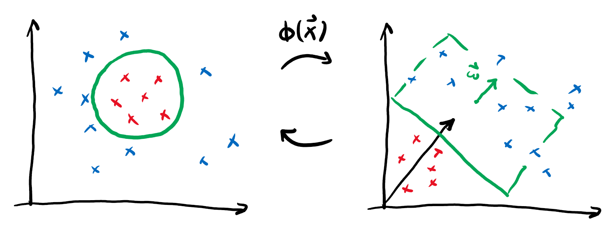
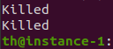
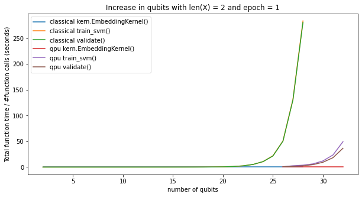

2DO:
 - Cite stuff
 - Correct typos
 - Collect resource estimation data
 - Collect cool images
 - Let it sit and come back to it later

Please note:
 - I just wrote whatever for a title, it should not stay like this
 - The first few sections are susceptible of being deleted altogether
 - The parts I'm less ashamed of begin with "Quantum Kernels"

# Trainable Quantum Kernels with Pennylane
## Or how finding good music title puns got out of hand

_By: Notorious FUB (Peter-Jan Derks, Paul Fährmann, Elies Gil-Fuster, Tom Hubregtsen, Johannes Jakob Meyer, and David Wierichs)_

### Quantum Machine Learning
% This shouldn't be very long, couple paragraphs

Throughout the 1990's and 2000's the field of Machine Learning (ML) experienced a series of breakthroughs which propelled it forward.
These breakthroughs did come at a high price, though: the research landscape was divided into opposing movements who had to fight countless peaceful battles against one another.
The survivors still today bear a troubled look when they explain how the shameless kernel methodists used to flex their nice math and performance promises, while the hardened feedfoward networkers couldn't help the prosperity backpropagation had brought being taken away from them under the unspeakable terror of vanishing gradients.

The advantage of the kernel folk, with their ubiquitous and shiny Support Vector Machine (SVM), was their trust in kernels that were powerful enough.
They didn't have to worry about concave optimization or other NP-hard problems.
In exchange, they had to pass through the hoop of model selection.

In the fray of the battle, a number of gray rebellious methodists thought they could take a shot of their enemies medicine.
They explored the concept of training their kernels in a networky fashion.

This is the story of what came out of that reckless attempt, and how the legacy of these ancient kernel _tamers_  has carried on through the generations and eventually turned quantum.

### Kernel methods

Kernel methods are one of the cornerstones of classical machine learning. Kernel boundaries allow us to use linear classifiers to establish non-linear decision boundaries:

The underlying "trick" is that any kernel will introduce a similarity measure, comparable to a scalar product, that allows us to unlock more complicated features of the underlying data. The beauty lies in the fact that the kernel implicitly contains an embedding of the data into a -- possibly infinite -- vector space -- and that we can use this to perform a linear classification in this space where the data is linearly separable.

### Quantum Kernels
% can go a bit deeper: talk about first proposals and recent theoretical work

### Trainable Kernels
% one paragraph classic includes formula for polarisation
% one paragraph quantum trainable kernels

Tackling Machine Learning tasks like regression or classification has become a common use case for Parameterised Quantum Circuits.
And so, a new field is born: Quantum Machine Learning.
Creative minds have organised themselves in peacefully competing teams: those who try to design promising Ansätze for certain uses, those who try to give content to the promises made by others in the form of positive theoretical results, and those who sometimes successfully manage to label some research paths as intransitable.
This is not something new.
Without going any further, a similar playing field was laid amidst Machine Learning researchers in the late 90s and early 2000s.
The survivors still explain with troubled looks that back then the kernel methodists were known for shamelessly flexing their nice math and performance promises, while the ruthless feedforward networkers had to see the joys that the advent of backpropagation prosperity had brought taken away from them under the unspeakable name of vanishing gradients.

The spirit of using kernel methods, and the ubiquitous Support Vector Machine (SVM), was to trust having a powerful enough kernel and not having to worry about concave optimization and other NP-hard problems.
In exchange, they had to pass through the model selection hoop.
It the fray of the battle, a number of gray personalities thought they could take a shot of their enemies medicine and explored the concept of training their kernels in a networky fashion.
Indeed, what if one could come up with a "kernel quality estimator" whose optimization delivered better performance?
Since one can change everything except what team they support, this of course brought with it every corresponding theoretical promise that things would work.
And so, the so-called kernel alignment and kernel polarisation were born.

A kernel with a high polarisation (or alignment, they are closely related) will display both high accuracy on train and good generalisation behavior.

Reminiscent to those wars is the current state of affaires in Quantum Machine Learning.
Ever so often the literature is enriched with a new variational circuit with promising accuracy, while some technical papers hint at the power of quantum kernels, and the entire thing sprinkled with nuclear head explosions revealing barren plateaus where we hoped there would not be any.
And so, in order to make the statement "history repeats itself" more true, here we are filling in for the role of trainable kernel turncoats.

Let us answer the question: cannot one just take some of the embedding techiques used in variational quantum circuits and use those as trainable kernels?

### Kernel alignment

When using kernel methods, one of the first things one has to do is select what kernel to use.
There are a plethora of them to choose from, but the evidence for a "one size fits them all" scenario are indeed notorious.
The Gaussian Kernel seems to work well in most occasions, the only remaining question being what value should its free parameter (the variance) take.
So, choosing this one kernel from all the possibilities is not enough, one still needs to specify it completely.  One way of going about this is to do a hyperparameter exhaustive search, test different possibilities, and stick with the one which presents the best performance.

Okay, this is not working, and maybe this shouldn't even be here.
Let's jump ahead

### Quantum Kernels

In her last preprint, Maria Schuld reaches the conclusion that parameterised quantum circuits used for machine learning can be repurposed into kernel methods.
In particular, she looks at Ansätze where the data embedding is separate from the data processing, and then proposes to use the data embedding as a building block to compute the kernel matrix using a quantum computer.
As one finds out among the results, kernel methods enjoy a privileged status among other ML techniques as they come accompanied by very strong theoretical promises.
For instance the representer Theorem features a twofold advantage: on the one hand it reduces the dimension of the optimization task, and on the other ensures the optimality of the solution found.

In exchange, it is no secret that the runtime scaling of kernel-based strategies in the size of the training set is far from ideal.
Still, it is very valuable to perform studies in quantum hardware because an advantage could come from fault-tolerant computers being able to perform otherwise costly matrix operations rather efficiently.

### Trainable Kernels

One important detail in Maria Schuld's approach is that the data embedding circuits considered do not feature free parameters that can be optimized.
This sets the footing for exploring whether lifting this restriction could bring a performance advantage.
Parameterised kernels are not exotic objects, as the most common classical kernel, the Gaussian one, contains a free parameter, the variance.
That being said, the Gaussian kernel flashes only one parameter, whereas trainable embedding circuits can go easily to linearly many parameters in the depth of the circuit.
This is an important difference!
Having one vs. many parameters amounts to performing exhaustive hyperparameter search being feasible vs. crazy.

Luckily, we are not alone in this fight.
During the early 2000s some proposals were made as alternatives to hyperparameter search.
Basing the approach in the heuristic notion that we want data instances to cluster by label in feature space, one can define a quantity that quantifies this clustering.
Kernels can be understood as a measure of similarity between pairs data instances on feature space.
Then, ideally we want pairs of instances with the same label to have a high similarity and pairs of instances with opposite labels to have low similarity.
We then need to write up a score function that favors high similarity between instances with the same label and penalises it for instances with opposite ones.
Think about it, write the simplest sum that does it, notice it looks like something from back in your undergrad Electromagnetism course, call it polarisation, and you are done!

Now our goal is clear: take a parameterised embedding, use it to build a quantum kernel, find the parameters which maximize the kernel polarisation, and then feed the kernel with the optimal choice of parameters to an SVM!

### Implementation
% JJM: one paragraph about implementation + demo

### Advantage of training
In order to assess the benefits of optimising the trainable kernel via its polarisation, we compare it to the kernel when deactivating the variational gates by setting them to zero (the neutral kernel) and to the kernel at random parameters. For each of the three parameter settings, we then train an SVM on the respective kernel and obtain a classification performance for our chosen dataset.
We find that the optimized kernel yields perfect classification of the data after training the SVM whereas both, the randomized and the neutral kernel fail to classify the entire dataset correctly obtaining only 66% accuracy each.
This demonstrates increased classification capabilities of a polarisation-trained kernel for a small an simple dataset.

### Noise issues
% issue + stabilisation

### Integration
% JJM: one paragraph how this goes into Pennylane

Coming up with some examples and writing single-use Pennylane-intensive scripts would have been enough in answering our fundamental question of whether trainable quantum kernels can provide some advantage.
This is nevertheless far from the spirit of a hackathon, where traditionally the idea was to develop a deliverable product.
Since we were already hacking the kernels using Pennylane's quantum circuit modules, we thought we might as well make this available for everyone!
This comprises the more tangible side of our project: the qml.kernels module!

Fully integrated into Pennylane, qml.kernels provides utilities ranging from building kernel functions just from arbitrary data embedding Ansätze, to the calculation of quality measures for kernels useful for training and up to stabilizing the kernel matrix, making sure it stays positive semidefinite even in the presence of sampling error or hardware noise.
Our team embraces the open-source approach of Pennylane, making sure our participation in QHack could have some lasting positive effect was especially important to us.

### Resources
% TH: resource estimates

In order to assess the feasibility of the various workloads and problems we could solve on the available hardware, we benchmarked the cost in terms of required time and dollars spend. We did this by first plotting the total function calls per dataset size, as shown in [plot]. This can then be used in combination with the time per circuit call in [plot] to find the expected runtime and by combining it with the cost per shot to find the financial budget to run on AWS. Between the hardware platforms, we found that Floq, compared to our classical server (16 CPU, 128G mem), was able to extend our capabilities by 7 additional qubits. This can also be viewed as a 2^7 speedup, which is what we confirmed experimentally: in 26-28 qubits regime we saw a 70 to 110x speedup. At 29 qubits, our classical machine choose Harakiri, whereas Floq caved at 33 qubits with a gracious "qubit size not in acceptable range". [Killed image] The AWS cloud simulation took significantly longer than local simulation, so we opted out of using these. The Rigetti machine through the AWS cloud servers did provide valuable insights in the performance of the kernel when subjected to noise, and was, apart from a factor 10 mistake, well within budget. 

### References

These are not sorted, they will be.

[1] M. Schuld: _Quantum Machine Learning Models are Kernel Methods_ https://arxiv.org/abs/2101.11020

[2] M. Schuld, R. Sweke, and J. J. Meyer: _The effect of data encoding on the expressive power of variational quantum machine learning models_ https://arxiv.org/abs/2008.08605

[3] A. Pérez-Salinas, A. Cervera-Lierta, E. Gil-Fuster, J. I. Latorre: _Data re-uploading for a universal quantum classifier_ https://quantum-journal.org/papers/q-2020-02-06-226/

[4] P. Wittek: _Quantum Machine Learning: what quantum computing means to data mining_ (Academic Press, 2014)

[5] J. Biamonte, P. Wittek, N. Pancotti, P. Rebentrost, N. Wiebe, and S. Lloyd: _Quantum Machine Learning_ Nature *549*, 195 (2017)

[6] V. Havlicek, A. D. Córcoles, K. Temme, A. W. Harrow, A. Kandala, J. M. Chow, J. M. Gambetta: _Supervised learning with quantum enhanced feature spaces_ Nature *567*, 209 (2019)

[7] T. Wang, D, Zhao, S. Tian: _An overview of kernel alignment and its applications_ (Springer Science+Business Media Dordrecht, 2012)

[8] M. Schuld, I. Sinayskiy, F. Petruccione: _An introduction to quantum machine learning_ https://arxiv.org/abs/1409.3097

[9] M. Schuld, N. Killoran: _Quantum machine learning in feature Hilbert spaces_ https://arxiv.org/abs/1803.07128
