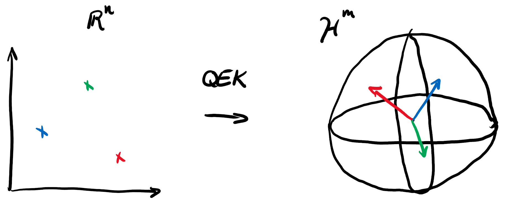
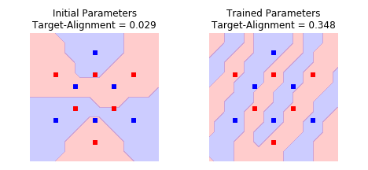
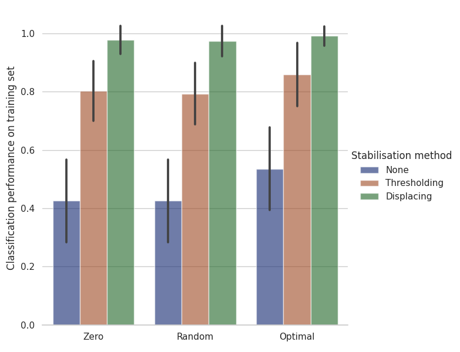
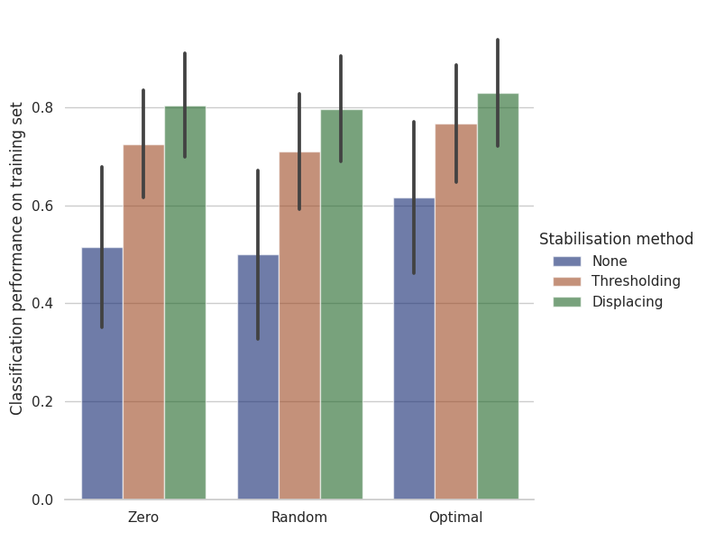
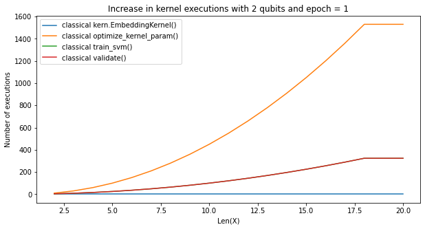
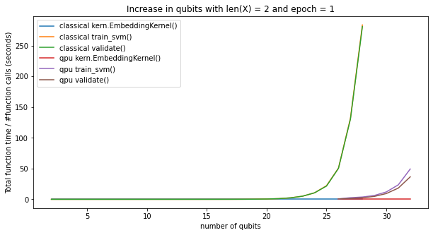
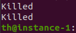

# Trainable Quantum Kernels with PennyLane [10]
### _Or how finding good music title puns got out of hand_

_By: Notorious F.U.B. (Peter-Jan Derks, Paul K. Faehrmann, Elies Gil-Fuster, Tom Hubregtsen, Johannes Jakob Meyer, and David Wierichs)_

We, the Notorious F.U.B., have been researching trainable quantum embedding kernels (QEKs).
This blogpost starts with an introduction to the history that lead to classical trainable kernels, followed by an ordered presentation of the important notions from kernel methods to trainable QEKs.
Following this we describe how we have shown that trained QEKs outperform untrained QEKs and that QEKs can succeed in classification tasks using our kernel stabilisation techniques against noise.
We explain our contributions to the PennyLane library, which we hope will benefit future research.
We also show results of runs on quantum hardware, showcasing our full stack implementation and proving noise resilience. 

## Classical Machine Learning 

Throughout the 1990's and 2000's the field of Machine Learning (ML) was propelled forward by a series of breakthroughs.
These breakthroughs did come at a high price, though: the research landscape was divided into opposing movements who had to fight countless peaceful battles against one another.
The survivors still today bear a troubled look when they explain how the shameless kernel methodists used to flex their nice math and performance promises, while the hardened feedfoward networkers couldn't help the prosperity backpropagation had brought being taken away from them under the unspeakable terror of vanishing gradients.

The advantage of the kernel folk, with their ubiquitous and shiny Support Vector Machine (SVM), was their trust in kernels that were powerful enough.
They didn't have to worry about concave optimization or other NP-hard problems.
In exchange, they had to pass through the hoop of model selection.

In the fray of the battle, a number of gray rebellious methodists thought they could take a shot of their enemies medicine.
They explored the concept of training their kernels in a networky fashion.

This is the story of what came out of that reckless attempt, and how the legacy of these ancient _kernel tamers_  has carried on through the generations and eventually turned quantum.

## Kernel Methods

Kernel methods allow us to use simple linear classifiers like the SVM to establish non-linear decision boundaries:

The underlying "trick" (no really - that's the official name!) is that any kernel will introduce a similarity measure, comparable to a scalar product, that allows us to unlock more complicated features of the underlying data.
The beauty lies in the fact that the kernel implicitly contains an embedding of the data into a -possibly infinite- vector space and that we can use this to perform a linear classification in this higher-dimensional space where the data is linearly separable.

## Quantum Embedding Kernels

By this time you all probably know by know that qml is a thing [1,4]...

Around the time John Preskill coined the acronym NISQ [3], there was one predominant trend in QML: 
to pick one Variational Quantum Circuit, one cost function, and one gradient-based optimization algorithm; and then perform classification or regression tasks à la Feedforward Neural Networks.
Not long afterwards, one first paper deviated from the mean.
Xanadu researchers proposed to exploit our access to the Hilbert space of quantum computers 
as a smart way of efficiently computing kernel matrices [5].
In their initial article, they even made use of an infinite-dimensional Hilbert space.

A few months later, Nature's frontpage featured IBM's effort in implementing the entire end-to-end pipeline of two supervised learning tasks on superconducting qubits [2].
The authors opened with a demonstration using an Ansatz along the predominant network-style trend.
But, unlike other similar proposals, they went on to use the embedding part of their Ansatz as the fundamental building block for a quantum kernel.

Both Xanadu's and IBM's approached differed in some fundamental details, but one thing was clear: 
the door to quantum kernel methods was open!
Building upon this belief Maria Schuld recently published _Quantum Machine Learning Models are Kernel Methods_ [7]. This paper elaborates the technical details of quantum kernels, so they stand on firm grounds for everyone else to build novel models.

## Trainable Kernels

Where we left off, the scene was that of a steamy battlefield: a small fraction of kernel methodists decided to step into their opponents shoes.
They have been brought up to repeat the same creed: _the first difficulty in using a kernel method is choosing the kernel_, but those times are gone.
Their experience in battle has taught them to trust the Gaussian Radial Basis Function as a one-size-fits-all solution, but still they struggle to specify the value of the variance parameter.
What these brave heroes want is a supervised learning approach for choosing the value, as they are all tired of exhaustively searching the hyperparameter space.

And indeed, they readily came up with a couple of good "kernel quality estimators".

We said a kernel is a measure of similarity in feature space between a pair of data instances.
It is not unreasonable to believe that a good kernel should find two points x1, x2 with the same label y1 = y2 more similar to one another than two points x3, x4 with opposite labels y3 = -y4.

Agreed? Agreed!

If we face the choice between two kernels, we will want to ask ourselves two questions:
Which one of them gives a higher similarity value to pairs within the same class?
Which is the one that gives a lower similarity to pairs of points from opposite classes?
If the answer to both questions is the same kernel, we will pick that kernel for our task.

One question still remains: could one write up a quantity computed from the kernel matrix entries that quantifies the within- and without-class similarity?
Think about it for a moment, write down the simplest sum that seems to do it, notice this looks very similar to something from back in your undergrad Electromagnetism course, call it polarisation (or alignment, if you thought of normalisation), and you are good to go!

Since we are still talking about kernel methods though, we can and should not forget our modus operandi.
A kernel with a high polarisation (or alignment) will display both high accuracy on its training dataset and good generalisation behavior on unseen data.
_"But we want beautiful math that decorates our tools and ensures their good behavior in general!"_.
Fret not! For [8] and its references have everyone's needs covered.

And so, in order to make the statement "history repeats itself" more true, here we are filling in for the role of trainable kernel turncoats.
We are the _quantum kernel tamers_!

## Trainable Quantum Embedding Kernels

One important detail in Maria Schuld's approach in [7] is that the data embedding circuits there considered do not feature free parameters that can be optimized.
This invites for exploring whether lifting this restriction could bring a performance advantage.

Parameterised kernels are not exotic objects per se, as the most common classical kernel, the Gaussian one, contains a free parameter: the variance.
That being said, the Gaussian kernel caps at that one parameter, whereas trainable embedding circuits can flash easily linearly many parameters in the depth of the circuit.
This is an important difference!
Having one vs. many parameters amounts to performing exhaustive hyperparameter search being feasible vs. crazy.

Now our goal is clear: take a parameterised embedding (e.g. one inspired by insights from [6], or a parameterised verision of the one from [2]), use it to build the trainable QEK, find the parameters which maximize the kernel alignment, and then feed the kernel with the optimal choice of parameters to an SVM!

## Integration
Coming up with some examples and writing single-use PennyLane-intensive scripts 
would have been enough in answering our fundamental question of whether trainable 
quantum kernels can provide some advantage.
This is nevertheless far from the spirit of a hackathon, 
where traditionally the idea was to develop a deliverable product.
Since we were already hacking the kernels using PennyLane's quantum circuit modules, 
we thought we might as well make this available for everyone.
This comprises the more tangible side of our project: the `qml.kernels` module!

Fully integrated into PennyLane, `qml.kernels` provides utilities ranging from 
building kernel functions just from arbitrary data embedding Ansätze, 
to the calculation of quality measures for kernels useful for training and up to 
stabilizing the kernel matrix, making sure it stays positive semidefinite even in 
the presence of sampling error or hardware noise.
Our team embraces the open-source approach of PennyLane, making sure our participation 
in QHack could have some lasting positive effect was especially important to us.

## Implementation

We wrote a PennyLane demonstration to showcase how simple it is to use the `qml.kernels` module to perform
an actual classification. We also explicitly show that we can use stochastic gradient descent and 
kernel-target alignment to tame the quantum kernel and improve the classification performance. 

To allow others to easily understand and reproduce our results, we also paraded our inner scholars and
included the theoretical background of kernel methods, quantum embedding kernels and the
kernel-target alignment as a measure of kernel quality for a specific dataset in such a way that 
every quantum-curious user can delve into the mathematical foundations.

**TODO: Mention floq integration for large scale datasets if the notebook makes it to the end**

## Advantage of Training

Our obsession with food made us elaborate our own dataset specifically for this project - the `DoubleCake`.
It has two features per sample and labels in two classes, the instance we consider contains 12 samples in total.
In order to assess the benefits of optimising the trainable QEK via its alignment, 
we compare it to the QEK at random parameters.
For each of the two parameter settings, we then train an SVM on the respective QEK and obtain a 
classification performance for our chosen dataset.

We find that the optimized QEK yields perfect classification of the data after training the SVM whereas 
the randomized parameter QEK fails to classify the entire dataset correctly, obtaining only 58% accuracy.
This demonstrates increased classification capabilities of an alignment-trained QEK for a small 
and simple dataset as the trained QEK adapts to the particular structure of the training data.

## Noise Issues

When looking forward to boosting classification tasks with trainable circuits, 
the influence of measurement or sampling noise certainly is an important aspect.
The question then arises whether the imperfect noisy kernel matrix that is 
obtained on a quantum computer can actually be of any use for the classification.
We asked this question for variants of the kernel used in our demonstration with 
zeroed, randomized and optimized parameters kernel and observed 
that shot noise does indeed harm the kernel matrix sufficiently 
to disrupt the classification performance.

This issue can be directly traced back to the indefiniteness of the kernel matrix due to the noise.
Hope would be lost for our quantum kernel if it wasn't for a small addition to the `qml.kernels` 
module that allows for postprocessing of the noisy kernel matrix to stabilise it against noise.
We implemented two different strategies to stbilize the kernel matrix:
First thresholding, which sets negative eigenvalues to zero and is equivalent to 
finding the positive semidefinite matrix that is closest to our noisy kernel matrix. 
Second, we implemented displacing by subtracting the identity scaled with the smallest eigenvalue.
This approach keeps the eigenvectors of the kernel matrix intact and yields a positive semidefinite matrix as well.

When applying either of these stabilisation techniques, we observe considerable restoration of the classification performance and in particular the simple matrix displacing yields close to perfect classification performance across many instances of sampled noise.
When computing a new kernel matrix for testing on the training data - and therefore emulating a testing situation more closely - the performance is not restored quite as completely but still our simple stablisiation routines improve the performance massively.

For our concrete application on the `DoubleCake` dataset, this stabilisation works for noise levels up to order of one, i.e. noise with relative standard deviation at and above 100%, as the kernel computes probabilities, which naturally are smaller or equal to one.

We thus implemented and tested two new methods to improve the applicability of (trainable) QEKs to classification tasks.

## Resources

In order to assess the feasibility of the various workloads and problems we could solve on the available hardware, we benchmarked the cost in terms of required time and dollars spend. We did this by first plotting the total function calls per dataset size, as shown in [plot]. 

This can then be used in combination with the time per circuit call in [plot] to find the expected runtime and by combining it with the cost per shot to find the financial budget to run on AWS. 

Between the hardware platforms, we found that Floq, compared to our classical server (16 CPU, 128G mem), was able to extend our capabilities by 7 additional qubits. This can also be viewed as a 2^7 speedup, which is what we confirmed experimentally: in 26-28 qubits regime we saw a 70 to 110x speedup. At 29 qubits, our classical machine choose Harakiri, whereas Floq caved at 33 qubits with a gracious "qubit size not in acceptable range". 

These extra qubits, for our project, can be used for extra data-embedding, increasing expressivity. One does need to be aware of the extra communication overhead, when accessing the service from Europe. For this, we deployed a virtual machine in Los Angelos, which increased our communication times with 20x. 

The Rigetti machine through the AWS cloud servers provided valuable insights in the performance of the kernel when subjected to noise, and was, apart from a factor 10 mistake, well within budget. 

## Conclusion

[dw:] This should go now, no?

Summary of what we have done.
A short part about the battlefield and stuff.
We believe there is once again hope in the hearts of the kernel methodists.

### References

[1] J. Biamonte, P. Wittek, N. Pancotti, P. Rebentrost, N. Wiebe, and S. Lloyd: _Quantum Machine Learning_ Nature *549*, 195 (2017)

[2] V. Havlicek, A. D. Córcoles, K. Temme, A. W. Harrow, A. Kandala, J. M. Chow, J. M. Gambetta: _Supervised learning with quantum enhanced feature spaces_ Nature *567*, 209 (2019)

[3] J. Preskill: _Quantum Computing in the NISQ era and beyond_ https://arxiv.org/abs/1801.00862v3

[4] M. Schuld, I. Sinayskiy, F. Petruccione: _An introduction to quantum machine learning_ https://arxiv.org/abs/1409.3097

[5] M. Schuld, N. Killoran: _Quantum machine learning in feature Hilbert spaces_ https://arxiv.org/abs/1803.07128

[6] M. Schuld, R. Sweke, and J. J. Meyer: _The effect of data encoding on the expressive power of variational quantum machine learning models_ https://arxiv.org/abs/2008.08605

[7] M. Schuld: _Quantum Machine Learning Models are Kernel Methods_ https://arxiv.org/abs/2101.11020

[8] T. Wang, D, Zhao, S. Tian: _An overview of kernel alignment and its applications_ (Springer Science+Business Media Dordrecht, 2012)

[9] P. Wittek: _Quantum Machine Learning: what quantum computing means to data mining_ (Academic Press, 2014)

[10] Proper academic document coming up

